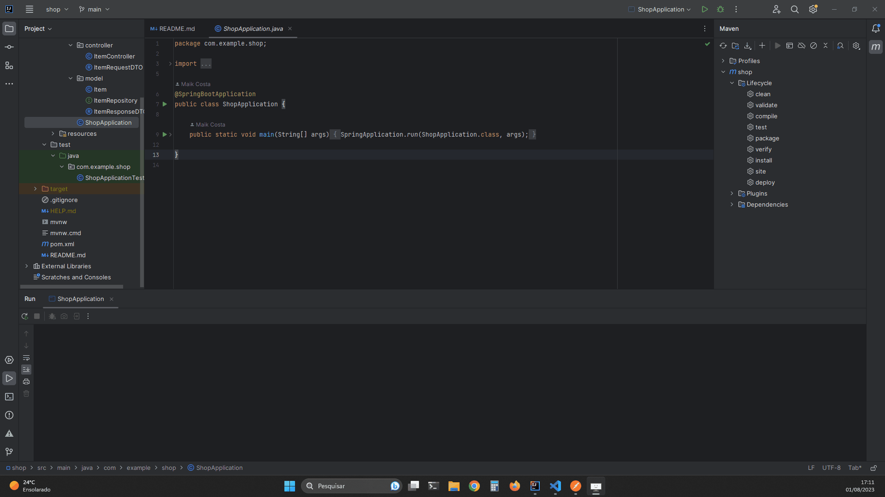

# Shop - Aplicação Frontend

Este projeto é um simples simples protótipo de um Shop Digital desenvolvido estudo em soluções full-stack. A aplicação foi desenvolvida usando **React, Typescript e React Query**.

<h1 align="center">
    
</h1>

## 💻 Requisitos

Antes de iniciar, você deve ter o Node.js e o NPM instalados em sua máquina.

## 🚀 Instalando

Primeiro, você deve clonar o projeto na sua máquina, para isso você
pode colar o seguinte comando em seu terminal

```bash
git clone https://github.com/maikcosta/shop-frontend
cd shop-frontend
```

Para instalar as dependências, execute o seguinte comando:

```bash
npm install
```

Por fim, para executar o projeto basta rodar o seguinte:

```bash
npm run dev
```

## 🔧 Compilação

Para compilar a aplicação para produção, execute o seguinte comando:

```bash
npm run build
```
Isso irá gerar uma versão otimizada da aplicação na pasta `dist`.

## 🫂 Integração com Backend

Para realizar a integração com o Backend, você pode [clonar o projeto](https://github.com/maikcosta/shop) e rodar localmente.

👉 [Link do repositório](https://github.com/maikcosta/shop)

## 📱 Minhas Redes

Meu site: [Maik Costa](https://maikcosta.github.io/) &nbsp;&middot;&nbsp; 

Instagram: [@maikcosta](https://www.instagram.com/maikcosta/) &nbsp;&middot;&nbsp;

YouTube [@maikcosta](https://www.youtube.com/@maikcosta) &nbsp;&middot;&nbsp;


## 📝 Licença

Este projeto está licenciado sob a licença MIT. Consulte o arquivo `LICENSE` para obter mais informações.
